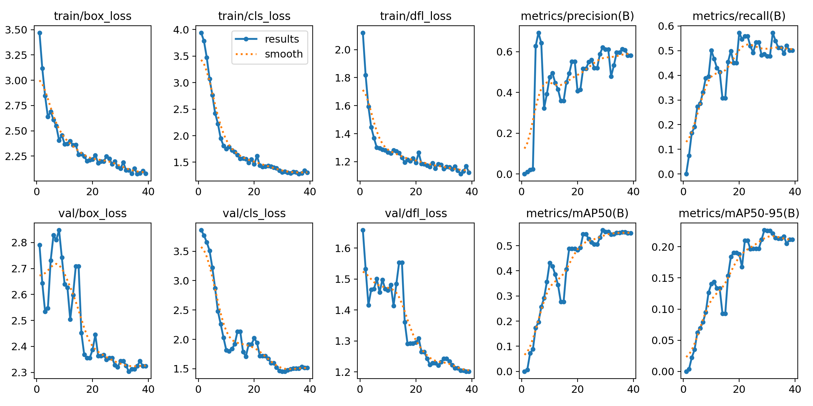
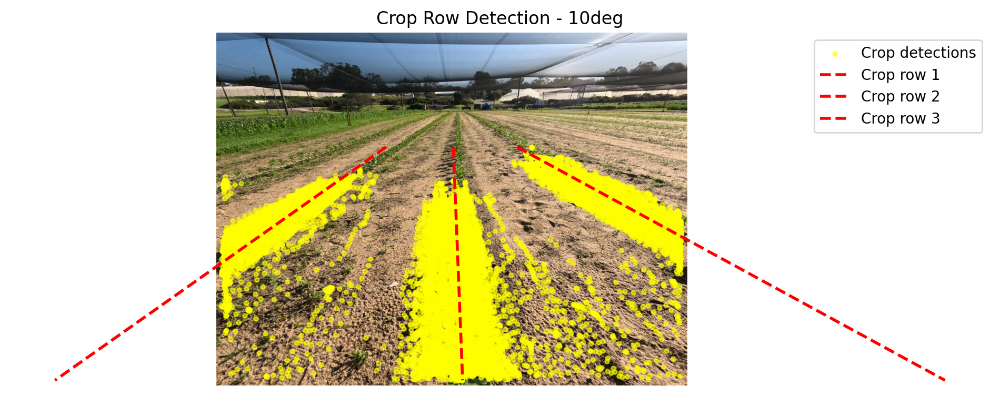
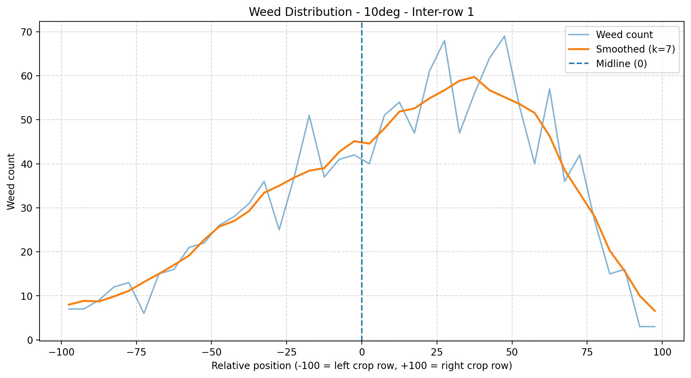
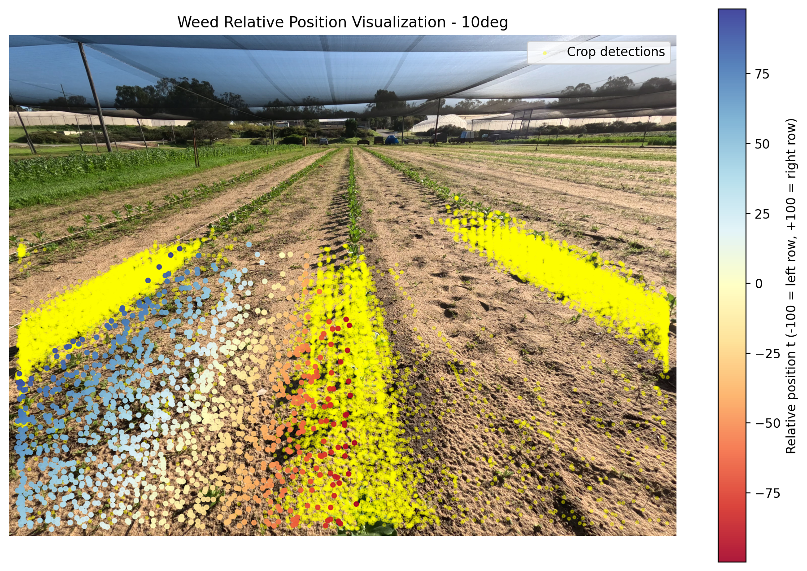

# 🌱 Weed Detection & Spatial Distribution Analysis

An end-to-end computer vision pipeline for detecting weeds in agricultural fields and analyzing their spatial distribution relative to crop rows.

---

## 🚀 Overview

This project processes field videos and performs:

* 🎥 Frame extraction from raw videos
* 🌿 Weed & crop detection using YOLOv8
* 🎯 Object tracking using ByteTrack (removes duplicate detections)
* 🌾 Crop row detection using KMeans + RANSAC
* 📊 Spatial analysis using Row Coordinate Mapping (RCM)
* 📈 Visualization of weed distribution patterns

👉 Goal: Provide insights for precision agriculture and automated weed management.

---

## 🧠 Key Highlights

* Built a **complete ML pipeline** from raw video → structured analysis
* Combined **deep learning (YOLO)** with **classical ML (KMeans + RANSAC)**
* Designed a **custom spatial mapping method (RCM)**
* Used **tracking to eliminate duplicate detections across frames**

---

## 🏗️ Project Structure

```
project_root/
├── data/               # Raw videos
├── dataset/            # Training dataset (YOLO format)
├── models/             # Trained weights (yolov8n.pt, best.pt)
├── results/
│   ├── csv/            # Detection outputs
│   ├── videos/         # Annotated videos
│   └── plots/          # Analysis visualizations
├── src/
│   ├── preprocessing/  # Frame extraction
│   ├── training/       # YOLO training
│   ├── inference/      # Detection + tracking
│   └── analysis/       # RCM & distribution analysis
```

---

## ⚙️ Pipeline

### 1️⃣ Run Detection & Tracking

```
python src/inference/run_inference.py
```

Output:

* CSV (detections with tracking IDs)
* Annotated video

---

### 2️⃣ Multi-Row Analysis (10°, 30°, 50°)

```
python src/analysis/multi_row_distribution.py
```

---

### 3️⃣ Single-Row Analysis (70°, 90°)

```
python src/analysis/single_row_distribution.py
```
## 📉 Model Performance

The YOLOv8 model was trained on a custom weed/crop dataset and evaluated on a validation set.

### Final Performance (Validation)

| Metric    | Value |
| --------- | ----- |
| Precision | ~0.60 |
| Recall    | ~0.50 |
| mAP50     | ~0.55 |
| mAP50-95  | ~0.22 |

These results indicate that the model achieves reasonable detection performance given the limited dataset size.

---

### 📊 Training Curves



---

### 📌 Observations

* Training loss (box, cls, dfl) decreases steadily, indicating stable convergence
* Validation loss follows a similar trend with minor fluctuations (expected for small datasets)
* Precision and recall improve significantly in early epochs and stabilize after ~20 epochs
* mAP50 shows consistent improvement, reaching ~0.55
* mAP50-95 remains lower (~0.22), indicating room for improvement in localization accuracy

---

### 📈 Summary

The model demonstrates stable learning behavior and produces reliable weed/crop detection results.
Performance is limited mainly by dataset size, but is sufficient for downstream spatial analysis tasks.

---

## 📊 Example Results

### 🌾 Crop Row Detection



### 📈 Weed Distribution



### 🎨 Spatial Visualization



---

## 🧪 Methods

### Detection

* YOLOv8 (Ultralytics)
* Transfer learning on custom dataset

### Tracking

* ByteTrack for consistent object IDs across frames

### Crop Row Detection

* KMeans clustering (initial grouping)
* RANSAC regression (robust line fitting)

### Spatial Analysis (RCM)

Weeds are mapped relative to crop rows using:

```
t = (d2 - d1) / (d1 + d2)
```

Where:

* `d1`, `d2` = distance to neighboring crop rows
* `t` = normalized position

---

## 🛠️ Tech Stack

* Python
* OpenCV
* Ultralytics YOLOv8
* NumPy / Pandas
* Scikit-learn
* Matplotlib

---

## 📌 What Makes This Project Strong

* Not just detection → **full analytical pipeline**
* Combines **deep learning + geometry + statistics**
* Practical application in **precision agriculture**
* Clean modular structure (production-style)

---

## 📈 Future Improvements

* Real-time processing (edge devices / drones)
* Larger dataset for improved accuracy
* Integration with automated weed control systems

---

## 👤 Author

**Enyong Zhao**
Master of Software Engineering
University of Western Australia
